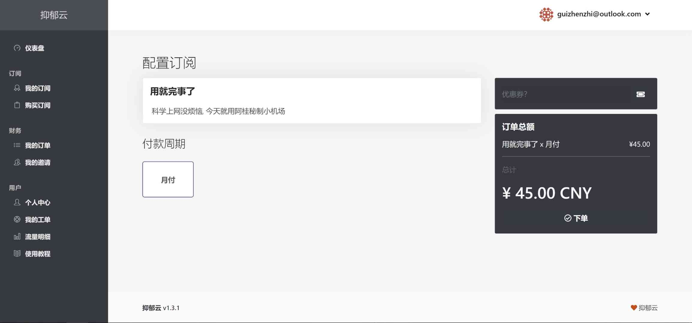

# 购买

如果你觉得套餐中的节点对你来说体验不错的话，买就完事了~ 🛒 妥妥的放心

为了从简，目前我们只有一个套餐，“用就完事了”。暂时定价为月付45元。日后如果大家有需求的话亦可以提供季付，半年付以及年付

## 支付 💸 

目前在我们的网站上仅支持支付宝支付

Step1: 进入立即订阅页面后选择月付，下单

Step2: 点击结账

Step3: 使用手机支付宝扫描二维码支付（如果好兄弟是在手机上进行操作，那就只能截图后在支付宝里付款了，目前还没有做到手机端自动跳转支付 ☹ ）

支付完成后等待一两分钟就可以自动开通完成啦~ 🥳 

#### 特殊情况

如果好兄弟使用支付宝支付有困难，希望通过微信支付，目前也暂时支持直接微信转账给我，但需要遵循下面步骤：

Step1: 进入结账界面后复制订单详情下方由“\#”开头的订单号

Step2: 找到我的个人账号进行转账，并发给我刚才复制的订单号，我会在收款后在后台为你们开通🤝。

## 下一步

如果还没有进行过程序安装，请阅读对应的系统代理程序安装教程









