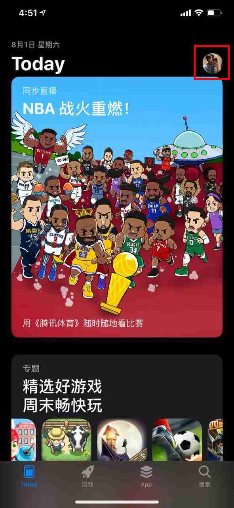
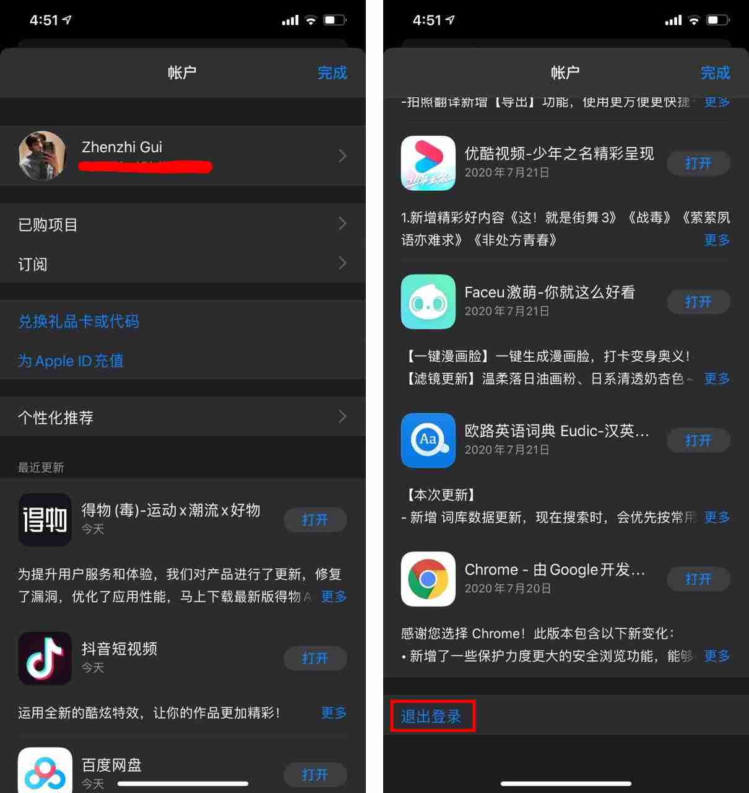
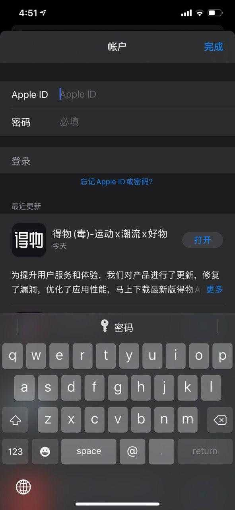
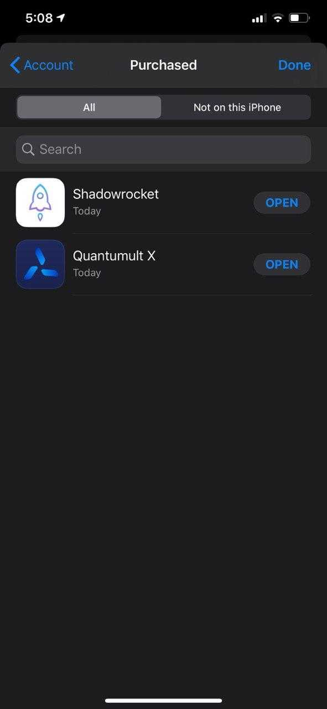

# 使用机场提供的AppleID的注意事项

已付费的好兄弟将可以在控制面板的**使用教程处**看到本机场提供的AppleID账号。但是使用此账号时必须在Apple Store中登录！**不要在设置中登录iCloud！不要在设置中登录iCloud！不要在设置中登录iCloud！**

**不清楚如何操作的请跟着下面的步骤**

Step1: 在App Store首页点开右上角的账户头像

Step2: 把这个页面下拉到最底部找到退出登录并点击它

Step3: 退出登录后重新回到页面顶端，输入我们提供的账号和密码选择并登录

Step4: 此时你可以在“purchased（已购项目）”中找到QuantumultX和Shadowrocket，或在商店中搜索下载

Step5: 下载应用后，请及时退出本账号并回到自己的账号中。退出方法与Step2相同

### Notes：

1. 此账号是机场为付费的好兄弟们无偿提供的，属于公用账号，目的是减少大家初次使用的麻烦，请勿向外传播
2. 由于苹果的风险控制比较严格，所以本账号随时有可能被封禁，不当的使用可能会加速封禁，请大家珍惜
3. 有能力的好朋友依旧建议在自己账号上自行购买，可以转换自己原有的Apple ID区域进行购买或者自己注册一个海外Apple ID进行购买。自己的账号使用更加方便，省心！目前QuantumultX美区售价$7.99，Shadowrocket美区售价$2.99（皆为税前）。依旧更加推荐大家使用QuantumultX（软件和我并无任何利益相关）。

## 下一步



