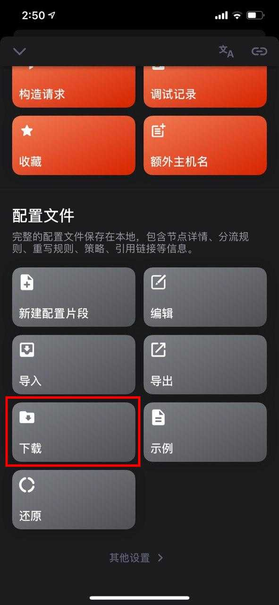
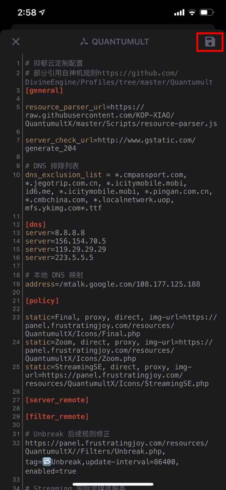

# QuantumultX

Step1: 长按复制以下链接                                                                                                                                                                [https://panel.frustratingjoy.com/resources/QuantumultX/QuantumultX.conf](https://panel.frustratingjoy.com/resources/QuantumultX/QuantumultX.conf)

Step2: 打开设置，下划到底部“配置文件”，点击下载

Step3: 在下载的输入框中粘贴刚才复制好的链接，点击确定

Step4: 待程序弹出下载好的配置文件预览，点击右上角的保存

完成啦 🥳 

## 下一步



