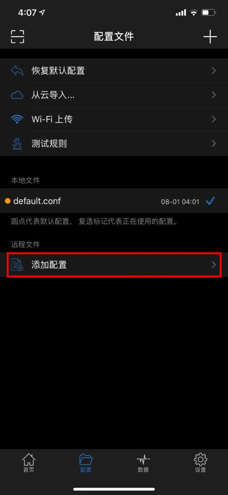
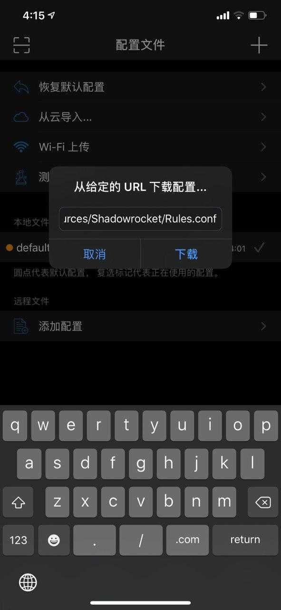
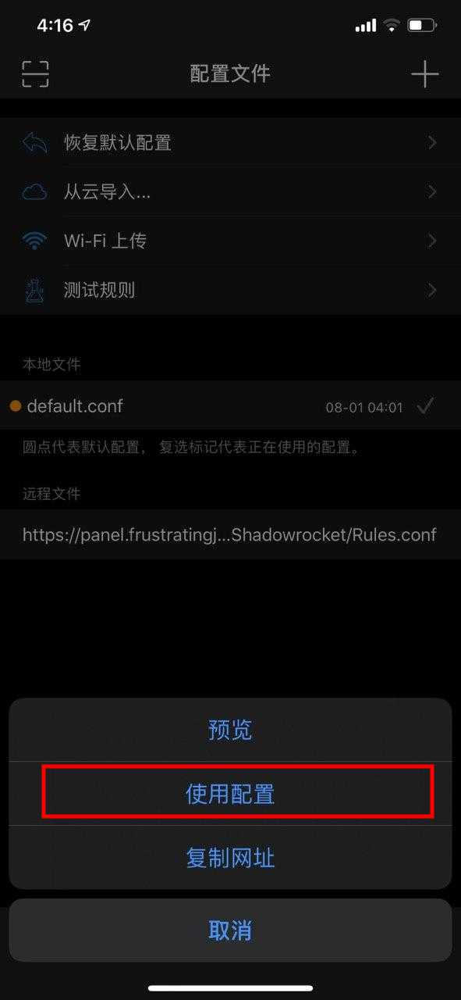

# Shadowrocket

Step1: 长按复制以下链接                                     [https://panel.frustratingjoy.com/resources/Shadowrocket/Rules.conf](https://panel.frustratingjoy.com/resources/Shadowrocket/Rules.conf)

Step2: 打开Shadowrocket，点击配置，在远程文件下选择添加配置

Step3: 在弹出的框内粘贴刚刚复制的链接，点击下载

Step4: 点击出现在远程文件一栏下面的文件，选择使用配置

完成啦 🥳 

## 下一步



