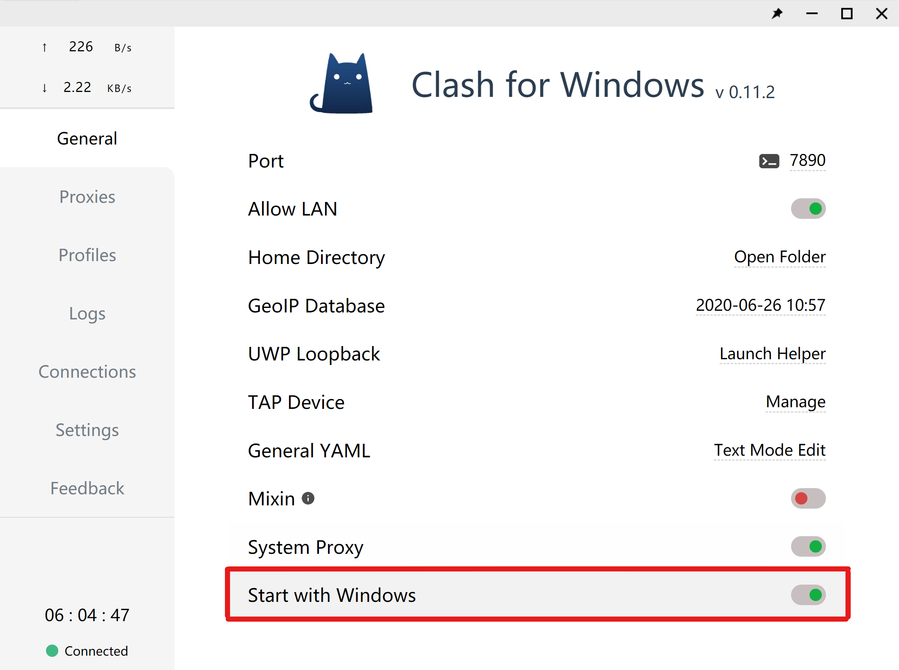

# Clash for Windows

安装好Clash for Windows后，首先我们可以将“Start with Windows”打开。这一设置可以让Clash for Windows在开机后自动启动。如果你在关机前并未手动关闭代理或软件，开机后也会维持代理开启的状态

在软件右侧"Settings"栏，Connections项下，分别将“Break When Proxy Change“改为”Chain“，”Break When Profile Change“，”Break When Mode Change“打开。更改这三项设置可以让用户在切换使用节点时打断已有的连接并用新选择的节点进行连接，否则会保持已有连接的状态不做改动。

Clash for Windows还有很多的设置项，有兴趣研究和自定义的可查阅Clash for Windows的官方文档

[☍Clash for Windows官方文档](https://docs.cfw.lbyczf.com/)

## 下一步



